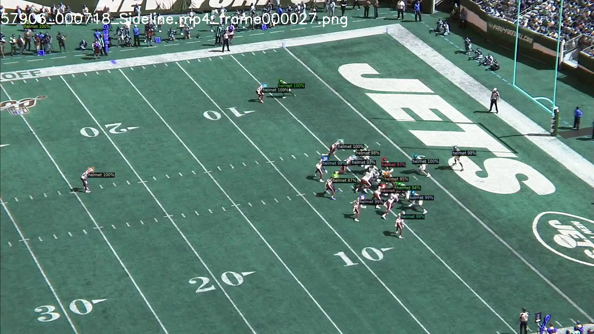

# Detect helmets in American Football footage 

This projects contains a retrained [Detectron2](https://github.com/facebookresearch/detectron2) Mask-RCNN object detection model that can detect helmets in football images.



## Requirements

Clone this repository first.

To install, you need `pytorch`, `sklearn`, `cv2`, `numpy`, `pandas` and `detectron2`.
You can also just install it via pip:

> pip3 install requirements.txt

If you want to deal with video data, you also need [ffmpeg](https://ffmpeg.org/download.html).

Due to the size of the model it couldn't be included in the repository itself. 

To download the model, head over to the [release page](https://github.com/thomasjungblut/football-helmet-detector/releases/tag/v1) and download `helmet_detector_model_0093999.pth` into the `output` folder. 

## Dataset

The data comes from the [NFL Impact Detection](https://www.kaggle.com/c/nfl-impact-detection) challenge that contains endzone and sideline footage of football plays. 

For training the data is expected in the data folder with the following mapping:
*  `data/train_labels.csv` from [train_labels.csv](https://www.kaggle.com/c/nfl-impact-detection/data?select=train_labels.csv)
*  `data/nfl_impact_images_train/{video_name}.mp4/{frame}.png` individual frames as PNG

To generate the frames in the right place and format, you can run `python3 preprocess_vids.py`, that will take the raw videos from the `data/train` folder. The videos in `data/train` are a download from [here](https://www.kaggle.com/c/nfl-impact-detection/data?select=train).

!!! Careful, this requires 65GB of disk space for the full dataset. 

## Model Performance

The model was evaluated using the standard COCO evaluation metrics. 
It was trained for 94k iterations (batch size 4) on 95% of the frames of the Kaggle dataset and 5% for the test set. 

Its AP@50 was at around 97% after 14h of training on a RTX2080 TI.

## Model Inference

For images, it's pretty easy, there is a small cmd that you can run, which takes an input image and outputs an output image. 

> python3 predict_image.py -i some.jpg -o some_output.jpg

Code-wise it is pretty easy:

```python
import cv2
from detectron2.data import MetadataCatalog
from detectron2.data.detection_utils import read_image
from detectron2.structures import Instances
from detectron2.utils.visualizer import Visualizer

from model import get_predictor

path = 'some.jpg'

predictor = get_predictor()
image = read_image(path, "BGR")
model_output = predictor(image)

model_output = model_output["instances"].to("cpu")
filter_mask = model_output.scores > 0.8
ni = Instances(model_output.image_size, **{
    "scores": model_output.scores[filter_mask],
    "pred_boxes": model_output.pred_boxes[filter_mask],
    "pred_classes": model_output.pred_classes[filter_mask]
})

img = cv2.imread(path)
v = Visualizer(img[:, :, ::-1], metadata=MetadataCatalog.get("nflimpact"))
img = v.draw_instance_predictions(ni).get_image()
# do whatever with img
```

For MP4 videos, you have to go through every frame and run the prediction and piece the video back together.
  
There is also a small cmd that you can run:

> python3 predict_video.py -i some.mp4 -o some_output.mp4

## Reproduce the Training

Given you put the training data in place already, the training just becomes:

> python3 train_helmet_detector.py

It will generate the training/test set first from the videos and save the dictionaries in a pickle file to speed-up the development cycle. If you need to regenerate these dictionaries, just delete the pickle file in the output folder.

As the training executes, you will be able to see it using tensorboard by running 

> tensorboard --logdir output 

All model configurations are default and relevant parameters, like learning rate schedules, are in the code.
